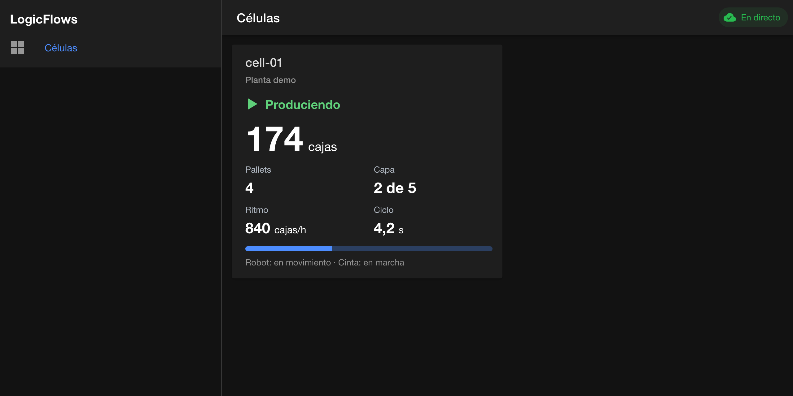
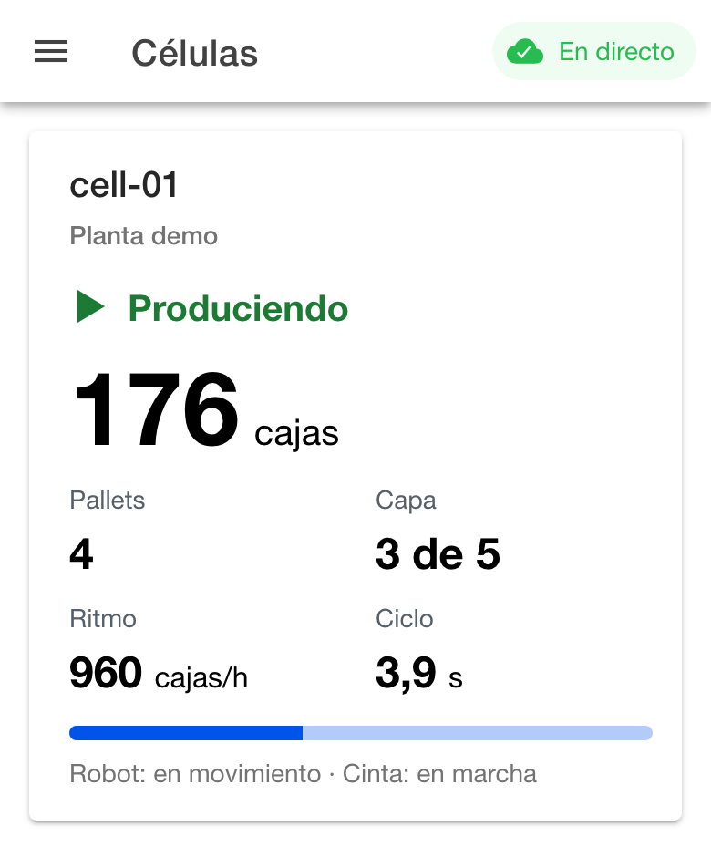
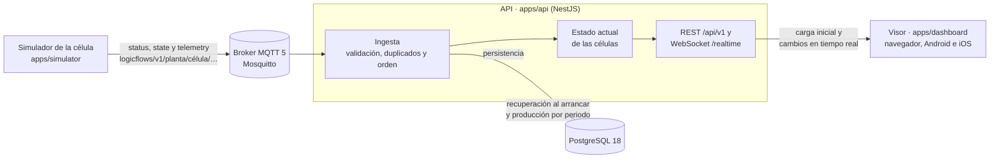

# LogicFlows

Plataforma IIoT para monitorizar en tiempo real células robotizadas de paletizado: estado de la máquina, producción y alarmas, desde la web y desde el móvil.

> **Estado:** [`v0.1.0`](CHANGELOG.md) publicada: **Hito 1 · Primera caja en pantalla**. En curso: **Hito 2 · Sistema desplegado**.

<p>
  
  
</p>

## Arranque rápido

Solo hace falta **Docker** con Docker Compose 2 (Docker Desktop, OrbStack o Colima con `docker-buildx`). En menos de 10 minutos el sistema completo funciona en local con una célula simulada:

```sh
git clone https://github.com/amariner/logicflows.git
cd logicflows
cp .env.example .env
docker compose --profile apps up -d --build --wait
```

La primera vez se descargan las imágenes base y se compilan las aplicaciones: unos 2 minutos con una conexión normal. Después:

| Qué | Dónde |
|---|---|
| Visor | <http://localhost:8100> |
| API y su documentación OpenAPI | <http://localhost:3000/docs> |
| Estado de la API | <http://localhost:3000/health/ready> |

El simulador arranca la célula `cell-01` de la planta `demo` y empieza a paletizar: el contador de cajas del visor avanza cada pocos segundos. Para ver averías, esperas y paradas de emergencia, se cambia `SIMULATOR_SCENARIO=demo` en `.env` y se vuelve a ejecutar el último comando ([escenarios](apps/simulator/README.md), [guion de la demo](docs/demo.md)).

Para detenerlo todo: `docker compose --profile apps down` (añadir `--volumes` para borrar también los datos).

Si el puerto 3000 o el 8100 están ocupados, se cambian con `API_PORT` y `DASHBOARD_PORT` en `.env`. Con Colima, el repositorio debe estar dentro de la carpeta personal: es la única que comparte por defecto con Docker, y fuera de ella el broker no encuentra su configuración.

## Arquitectura



- **Simulador** ([`apps/simulator`](apps/simulator)): reproduce una célula robotizada de paletizado con su máquina de estados ([ADR-0003](docs/adr/0003-estados-de-la-paletizadora.md)), alarmas y escenarios de incidencias y de red inestable. Publica por MQTT el estado, la telemetría y su conexión.
- **Broker MQTT** (Eclipse Mosquitto): desacopla las células de la plataforma. Los mensajes son JSON versionado en topics `logicflows/v1/{planta}/{célula}/{tipo}`, con autenticación y listas de control de acceso ([ADR-0004](docs/adr/0004-mensajes-de-telemetria-y-topics-mqtt.md)).
- **Contrato** ([`packages/contract`](packages/contract)): topics, tipos y validación compartidos por las tres aplicaciones. Un cambio incompatible falla al compilar ([ADR-0005](docs/adr/0005-paquete-del-contrato.md)).
- **API** ([`apps/api`](apps/api), NestJS): valida cada mensaje y descarta duplicados y desordenados. Mantiene el estado actual de cada célula, lo persiste en PostgreSQL ([ADR-0007](docs/adr/0007-acceso-a-datos-y-migraciones.md)) y lo ofrece por REST y por un canal WebSocket de tiempo real ([ADR-0006](docs/adr/0006-canal-de-tiempo-real.md)).
- **Visor** ([`apps/dashboard`](apps/dashboard), Ionic y Angular): muestra el estado, la producción y las alarmas de cada célula siguiendo ISA-101 y WCAG 2.2 AA ([diseño](docs/diseno-del-visor.md)). Funciona en el navegador y, con Capacitor, como aplicación de Android e iOS ([ADR-0002](docs/adr/0002-visor-multiplataforma.md)).

Cada aplicación se empaqueta como imagen Docker configurable solo con variables de entorno, de modo que la misma imagen sirve para cualquier entorno ([imágenes](#imágenes-docker)).

## Decisiones de arquitectura

Las decisiones relevantes se registran como ADR en [`docs/adr`](docs/adr/README.md):

| ADR | Decisión |
|---|---|
| [0001](docs/adr/0001-gestor-de-paquetes-y-orquestacion.md) | pnpm workspaces como gestor del monorepo, sin orquestador de tareas |
| [0002](docs/adr/0002-visor-multiplataforma.md) | Visor multiplataforma con Ionic, Angular y Capacitor |
| [0003](docs/adr/0003-estados-de-la-paletizadora.md) | Siete estados de la paletizadora, alineados con PackML |
| [0004](docs/adr/0004-mensajes-de-telemetria-y-topics-mqtt.md) | Mensajes JSON sobre MQTT 5, topics versionados y Mosquitto como broker |
| [0005](docs/adr/0005-paquete-del-contrato.md) | Contrato compartido con Zod y JSON Schema |
| [0006](docs/adr/0006-canal-de-tiempo-real.md) | WebSocket nativo para el tiempo real entre la API y el visor |
| [0007](docs/adr/0007-acceso-a-datos-y-migraciones.md) | Drizzle ORM sobre PostgreSQL con migraciones SQL versionadas |
| [0009](docs/adr/0009-autenticacion-y-autorizacion.md) | OpenID Connect con Keycloak; tiques para el WebSocket y credenciales MQTT por célula |

## Estructura

Monorepo gestionado con pnpm workspaces ([ADR-0001](docs/adr/0001-gestor-de-paquetes-y-orquestacion.md)). Las aplicaciones desplegables viven en `apps/` y las librerías compartidas en `packages/`:

```text
logicflows/
├── apps/
│   ├── simulator/   # Simulador de la célula de paletizado
│   ├── api/         # API NestJS: ingesta MQTT, persistencia, REST y WebSocket
│   └── dashboard/   # Visor con Ionic, Angular y Capacitor
├── packages/
│   └── contract/    # Contrato de telemetría compartido: topics, tipos y validación
├── infra/           # Configuración de la infraestructura local
└── docs/
    └── adr/         # Decisiones de arquitectura
```

## Requisitos para desarrollar

- **Docker** con Docker Compose, para la infraestructura local.
- **pnpm 11.** La versión exacta está fijada en el campo `packageManager` de `package.json`. Con Corepack, incluido en Node.js, basta con ejecutar `corepack enable`.
- **Node.js.** No hace falta instalar una versión concreta: pnpm descarga y usa la fijada en `devEngines.runtime` (24.21.0). El fichero `.nvmrc` la declara también para editores y gestores de versiones.

## Comandos

| Comando | Qué hace |
|---|---|
| `pnpm install` | Instala las dependencias de todo el workspace según `pnpm-lock.yaml` |
| `pnpm install --frozen-lockfile` | Instalación reproducible: falla si el lockfile no coincide con los `package.json` (la usa la CI) |
| `pnpm check` | Verificación completa: formato, tipos, lint, pruebas y build de todos los paquetes |
| `pnpm format` | Aplica el formato común (Prettier) a todo el repositorio |
| `pnpm format:check` · `pnpm typecheck` · `pnpm lint` · `pnpm test` · `pnpm build` | Cada comprobación por separado |
| `pnpm test:integration` | Pruebas de integración con contenedores reales; necesita Docker ([estrategia de pruebas](docs/estrategia-de-pruebas.md)) |
| `pnpm test:e2e` | Prueba de extremo a extremo contra el sistema levantado con `pnpm stack:up` |
| `pnpm --filter @logicflows/api <script>` | Ejecuta un script en un único paquete |

Cada paquete expone los mismos scripts (`typecheck`, `lint`, `test` y `build`) a medida que se implementa; los comandos de la raíz omiten los paquetes que aún no los definen. pnpm los ejecuta en orden topológico: un paquete se procesa después de aquellos de los que depende.

### Seguridad de las dependencias

`pnpm-workspace.yaml` aplica dos defensas frente a paquetes comprometidos:

- **Antigüedad mínima.** pnpm no instala versiones publicadas hace menos de un día (su valor por defecto) y `minimumReleaseAgeStrict: true` impide que lo haga en silencio cuando se pide una versión más reciente: la instalación falla. La mayoría de las versiones maliciosas se detectan y retiran en esas primeras horas. Si una corrección de seguridad urgente lo exige, se añade una excepción en `minimumReleaseAgeExclude` y se justifica en la pull request.
- **Scripts de instalación.** Las dependencias con scripts de instalación (`postinstall`) no los ejecutan salvo que se autoricen en `allowBuilds`, y la instalación falla mientras haya alguno sin decidir. Cada entrada se decide al revisar la pull request que añade la dependencia. Hoy se deniegan todos los que aparecen: `cpu-features`, `ssh2` y `protobufjs` (opcionales de Testcontainers); `esbuild`, `@parcel/watcher`, `lmdb` y `msgpackr-extract` (herramientas de Angular, que distribuyen binarios precompilados); y `@scarf/scarf`, que envía estadísticas de instalación a un servidor externo.

pnpm reescribe este fichero al modificar la configuración y elimina los comentarios, por eso las decisiones se documentan aquí.

## Desarrollo local

Para desarrollar no se usan las imágenes: las aplicaciones se ejecutan con pnpm, con recarga automática, y Docker Compose levanta la infraestructura que necesitan: el broker MQTT (Eclipse Mosquitto) y PostgreSQL, ambos accesibles solo desde el propio equipo.

```sh
cp .env.example .env   # una sola vez; ajustar si hace falta
pnpm infra:up          # arranca y espera a que ambos servicios estén sanos
```

| Comando | Qué hace |
|---|---|
| `pnpm infra:up` | Arranca el broker y la base de datos y espera a que superen sus comprobaciones de salud |
| `pnpm infra:down` | Detiene los servicios conservando los datos |
| `pnpm infra:reset` | Detiene los servicios y **elimina los datos**: mensajes retenidos, sesiones y base de datos |
| `pnpm infra:logs` | Muestra los registros en tiempo real |
| `pnpm simulator` | Arranca el [simulador](apps/simulator) de una célula que publica en el broker local |
| `pnpm api` | Arranca la [API](apps/api) en modo desarrollo en `http://localhost:3000`, con la documentación en `/docs` |
| `pnpm dashboard` | Arranca el [visor](apps/dashboard) en modo desarrollo en `http://localhost:4200` |
| `pnpm stack:up` · `pnpm stack:down` | Arranca o detiene el sistema completo en contenedores (ver más abajo) |

| Servicio | Dirección | Credenciales |
|---|---|---|
| Mosquitto (MQTT 5) | `mqtt://127.0.0.1:1883` | Usuarios `api` (lectura) y `simulator` (escritura); contraseñas en `.env` |
| PostgreSQL 18 | `postgres://127.0.0.1:5432` | Usuario, contraseña y base de datos en `.env` |

La configuración del broker está en [`infra/mosquitto`](infra/mosquitto): no admite clientes anónimos y una lista de control de acceso limita lo que puede hacer cada usuario ([ADR-0004](docs/adr/0004-mensajes-de-telemetria-y-topics-mqtt.md)). Los datos se conservan en volúmenes de Docker entre reinicios.

Para inspeccionar los mensajes publicados:

```sh
docker compose exec mosquitto mosquitto_sub -u api -P api-local -t 'logicflows/v1/#' -v
```

### Sistema completo en contenedores

`pnpm stack:up` equivale al [arranque rápido](#arranque-rápido): añade a la infraestructura las tres aplicaciones, construidas con el [`Dockerfile`](Dockerfile) de la raíz, y espera a que estén sanas. `pnpm test:e2e` ejecuta la prueba de extremo a extremo contra este sistema ([estrategia de pruebas](docs/estrategia-de-pruebas.md)) y `pnpm stack:down` lo detiene. La API en contenedor usa el mismo puerto que `pnpm api`, así que no se ejecutan las dos a la vez.

### Imágenes Docker

Un único `Dockerfile` con una etapa por aplicación comparte la instalación y la compilación del monorepo:

| Imagen | Etapa | Base | Configuración |
|---|---|---|---|
| API | `api` | `node:24.21.0-alpine`, usuario `node` | Variables de la API en `.env.example`; comprobación de salud en `/health/live` |
| Simulador | `simulator` | `node:24.21.0-alpine`, usuario `node` | Variables `MQTT_*` y `SIMULATOR_*`; `docker stop` detiene la célula de forma controlada |
| Visor | `dashboard` | `nginx-unprivileged` (Alpine), puerto 8080 | `API_URL`: al arrancar se genera `config.json` con ella |

```sh
docker build --target api -t logicflows-api .
```

Las imágenes no contienen configuración de ningún entorno: la misma imagen sirve para local, pruebas o producción y todo se indica con variables de entorno al arrancar. Las imágenes Node solo incluyen las dependencias de producción (`pnpm deploy --prod`). Las de Node se compilan sobre Debian porque pnpm descarga el Node fijado en `devEngines` desde nodejs.org, que no publica binarios oficiales de Alpine para ARM.

## Integración continua

Cada pull request contra `main` y cada cambio en `main` ejecutan el workflow [CI](.github/workflows/ci.yml) en GitHub Actions: instalación con `--frozen-lockfile`, formato, tipos, lint, pruebas y build; en paralelo, las pruebas de integración con Testcontainers, la accesibilidad del visor y la construcción de las imágenes Docker con el arranque del sistema completo y la prueba de extremo a extremo. Cada comprobación es un paso independiente para identificar de un vistazo qué ha fallado. Las comprobaciones tienen un límite de 10 minutos (15 el trabajo que construye las imágenes) y una nueva ejecución en la misma rama cancela la anterior.

## Calidad del código

La configuración de calidad es común a todo el monorepo y cada paquete la hereda:

| Fichero | Contenido |
|---|---|
| `tsconfig.base.json` | TypeScript en modo estricto, con comprobaciones adicionales como `noUncheckedIndexedAccess` y `noImplicitOverride`. Cada paquete lo extiende y añade la configuración de módulos de su entorno. |
| `eslint.config.js` | ESLint con las reglas `strictTypeChecked` y `stylisticTypeChecked` de typescript-eslint. Cada paquete lo importa desde su `eslint.config.js` y añade las reglas de su framework. |
| `.prettierrc.json` | Formato del código, JSON y YAML. La documentación en Markdown queda excluida. |
| `.editorconfig` | Codificación, finales de línea y sangría para cualquier editor. |

Ejemplo para un paquete:

```jsonc
// apps/simulator/tsconfig.json
{
  "extends": "../../tsconfig.base.json",
  "compilerOptions": { "module": "nodenext", "moduleResolution": "nodenext" },
  "include": ["src"]
}
```

```js
// apps/simulator/eslint.config.js
import { baseConfig } from '../../eslint.config.js';

export default baseConfig;
```

TypeScript está fijado en la versión 6.0 porque Angular 22 y typescript-eslint todavía no admiten TypeScript 7.

## Documentación

- [Registro de cambios](CHANGELOG.md)
- [Guion de la demo](docs/demo.md)
- [Decisiones de arquitectura (ADR)](docs/adr/README.md)
- [Guía de contribución y Definition of Done](CONTRIBUTING.md)
- [Estrategia de pruebas](docs/estrategia-de-pruebas.md)
- [Diseño del visor](docs/diseno-del-visor.md)
