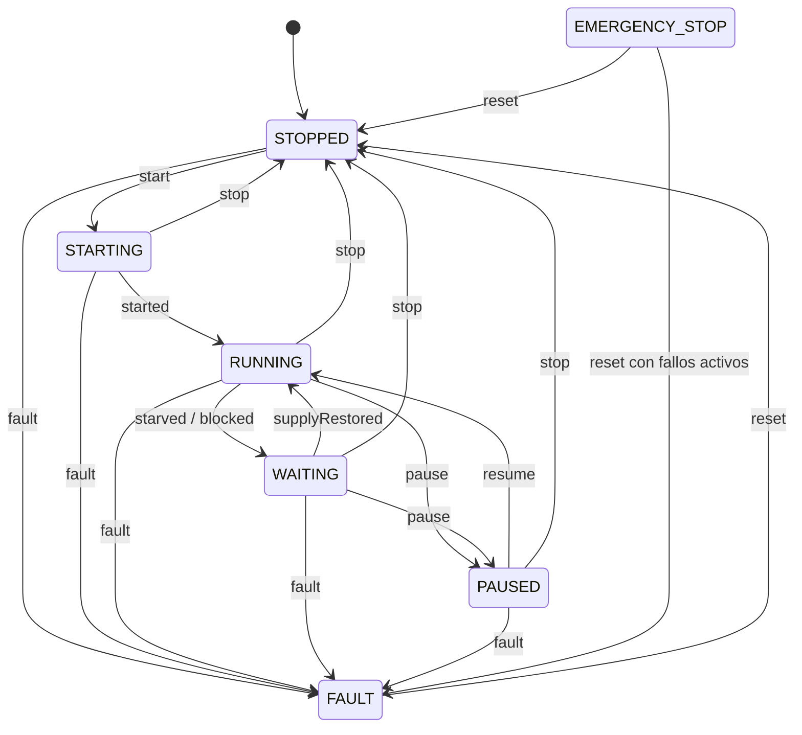

# ADR-0003: Estados y transiciones de la paletizadora

- **Estado:** Aceptado
- **Fecha:** 2026-09-30
- **Responsable:** Andreu Mariner, Tech Lead
- **Tarea:** LF-19

## Contexto

El estado de la célula de paletizado es el dato más consultado del sistema: el visor lo muestra en primer plano, la API lo persiste y los indicadores de disponibilidad dependen de él. El simulador, la API y el visor deben interpretarlo igual.

La planificación partía de seis estados candidatos: `STOPPED`, `STARTING`, `RUNNING`, `PAUSED`, `FAULT` y `EMERGENCY_STOP`. Al revisarlos aparecen tres preguntas sin resolver:

- **Paradas por causas externas.** La causa de parada más frecuente de una paletizadora no es un fallo propio, sino la falta de cajas a la entrada o una salida de pallets ocupada. Con los estados candidatos no se distinguiría de una pausa del operador, y los indicadores atribuirían a la célula pérdidas que se originan en otras máquinas de la línea.
- **Rearme.** No estaba definido cómo se sale de un fallo o de una parada de emergencia, ni si la célula puede volver a producir sin una orden explícita.
- **Estándares del sector.** Las máquinas de envasado y paletizado suelen seguir el modelo de estados PackML (ISA-TR88.00.02), que define 17 estados. La conexión futura con planta real mediante OPC-UA se beneficiará de un modelo compatible con él.

El estado lo determina siempre la máquina: hoy el simulador y, en el futuro, el PLC. La API y el visor lo reciben, lo validan y lo presentan; no deciden transiciones.

## Opciones consideradas

1. **Los seis estados candidatos**, sin cambios.
2. **Modelo PackML completo**, con sus 17 estados.
3. **Modelo simplificado compatible con PackML:** los estados candidatos más un estado de espera por causa externa, con una correspondencia documentada con PackML.

## Decisión

Se adopta la **opción 3**: siete estados con correspondencia con PackML.

### Estados

| Estado | Significado | PackML |
|---|---|---|
| `STOPPED` | Célula detenida de forma controlada, sin fallos activos y lista para arrancar. | Stopped, Idle |
| `STARTING` | Secuencia de arranque en curso: aviso acústico y luminoso y robot a su posición de referencia. | Starting |
| `RUNNING` | Produciendo con normalidad. | Execute |
| `WAITING` | En marcha pero sin poder producir por una causa externa a la célula. Reanuda sola cuando la causa desaparece. | Suspended |
| `PAUSED` | Detenida por el operador con el ciclo a medias. Se reanuda con una orden, sin repetir el arranque. | Held |
| `FAULT` | Detenida por un fallo de la propia célula. Requiere intervención y rearme. | Aborted |
| `EMERGENCY_STOP` | Parada de emergencia activada por la cadena de seguridad. Requiere liberar el pulsador, rearmar la seguridad y rearmar la célula. | Aborted |

`WAITING` indica siempre su causa:

- `STARVED`: no llegan cajas a la entrada.
- `BLOCKED`: la salida de pallets está ocupada.

### Diagrama de estados

La parada de emergencia no aparece en el diagrama para no saturarlo: **se puede producir desde cualquier estado** y lleva siempre a `EMERGENCY_STOP`.

### Transiciones

| Evento | Desde | Hacia | Condición |
|---|---|---|---|
| `start` | `STOPPED` | `STARTING` | Orden del operador. Sin fallos activos ni parada de emergencia. |
| `started` | `STARTING` | `RUNNING` | Secuencia de arranque completada. |
| `starved` / `blocked` | `RUNNING` | `WAITING` | Falta de cajas o salida ocupada. |
| `supplyRestored` | `WAITING` | `RUNNING` | La causa externa ha desaparecido. |
| `pause` | `RUNNING`, `WAITING` | `PAUSED` | Orden del operador. |
| `resume` | `PAUSED` | `RUNNING` | Orden del operador. Si persiste una causa externa, pasa a continuación a `WAITING`. |
| `stop` | `STARTING`, `RUNNING`, `WAITING`, `PAUSED` | `STOPPED` | Orden del operador. La célula termina el movimiento en curso y se detiene de forma controlada. |
| `fault` | Cualquiera salvo `FAULT` y `EMERGENCY_STOP` | `FAULT` | Fallo de la célula: robot, cinta, sensores o PLC. |
| `reset` | `FAULT` | `STOPPED` | Orden del operador. La causa del fallo ha desaparecido. |
| `emergencyStop` | Cualquiera salvo `EMERGENCY_STOP` | `EMERGENCY_STOP` | Pulsador o dispositivo de seguridad. |
| `reset` | `EMERGENCY_STOP` | `STOPPED` o `FAULT` | Pulsador liberado y seguridad rearmada. Pasa a `FAULT` si hay fallos activos. |

### Reglas

1. **Prioridad.** `EMERGENCY_STOP` prevalece sobre `FAULT`, y `FAULT` sobre cualquier otro estado. Un fallo detectado durante una parada de emergencia se registra como alarma, pero el estado sigue siendo `EMERGENCY_STOP` hasta el rearme.
2. **Sin rearranque automático.** Tras un fallo o una parada de emergencia, la célula vuelve siempre a `STOPPED` y necesita una orden `start` explícita. Rearmar no pone la máquina en marcha, como exige la normativa de seguridad de máquinas.
3. **Varias causas de espera.** Si coinciden la falta de cajas y la salida ocupada, se informa de `BLOCKED`, porque no se resuelve aunque lleguen cajas.
4. **La máquina es la fuente de verdad.** La API registra el estado que informa la máquina aunque la transición no figure en esta tabla, por ejemplo al perder mensajes intermedios por una desconexión. Una transición no prevista se registra como aviso para su diagnóstico, pero nunca se rechaza. La detección de mensajes perdidos, duplicados o desordenados se define en ADR-0004.
5. **Estado de la célula frente a estado de sus componentes.** Estos estados describen la célula completa. El estado del robot y de la cinta se transmite como información de detalle en la telemetría (ADR-0004) y no altera las reglas anteriores.

## Justificación

**Frente a los seis estados candidatos.** Sin `WAITING`, una célula sin cajas aparecería como `PAUSED` o `RUNNING`. En el primer caso los indicadores culparían al operador de una espera que no provoca; en el segundo se ocultaría que la célula no produce. Distinguir la espera por causa externa es imprescindible para calcular la disponibilidad y para que el equipo de planta sepa dónde actuar.

**Frente a PackML completo.** PackML describe también estados transitorios (`Stopping`, `Holding`, `Unholding`, `Clearing`…) y modos de operación que el simulador tendría que reproducir y el visor mostrar. Aportan valor al programar el PLC, pero no a la supervisión que ofrece LogicFlows. Con siete estados el operador entiende el visor sin formación y el simulador sigue siendo sencillo.

**Correspondencia con PackML.** Documentarla ahora permite que un futuro agente edge traduzca los estados de un PLC real con OPC-UA sin cambiar el contrato.

**`FAULT` y `EMERGENCY_STOP` separados.** Ambos corresponden a `Aborted` en PackML, pero su procedimiento de rearme es distinto, la parada de emergencia tiene implicaciones de seguridad para las personas y el visor debe mostrarla con la máxima prioridad.

## Alternativas descartadas

**Los seis estados candidatos.** Son más sencillos, pero confunden las esperas externas con pausas o con producción normal, lo que invalidaría los indicadores de disponibilidad del Hito 1.

**PackML completo.** Es el estándar del sector y facilitaría la integración con algunas máquinas reales. Se descarta porque duplica la complejidad del simulador y del visor sin mejorar la supervisión. La correspondencia documentada cubre la necesidad de integración.

## Consecuencias

**Positivas:**

- Un vocabulario común para ingeniería industrial, backend y frontend.
- Indicadores de disponibilidad que separan las pérdidas propias de las ajenas.
- Reglas de rearme alineadas con la seguridad de máquinas.
- Integración futura con PLC reales facilitada por la correspondencia con PackML.
- La tabla de transiciones sirve de especificación para las pruebas del simulador y del contrato.

**Costes y riesgos:**

- Un estado más que los candidatos y una causa asociada que el simulador debe generar y el visor mostrar.
- Aceptar transiciones no previstas exige registrar y vigilar esos avisos para no ocultar errores del simulador o del PLC.
- Las máquinas reales que no sigan PackML necesitarán una traducción específica en el agente edge.

## Criterios de revisión

Esta decisión se revisará mediante un nuevo ADR si se cumple alguna de estas condiciones:

- Se conecta una máquina real cuyos estados no se puedan traducir a este modelo sin perder información relevante para la supervisión.
- Se necesita distinguir modos de operación, como manual, automático o mantenimiento.
- Los indicadores requieren estados que hoy no existen, como el cambio de formato de producto.

## Referencias

- [PackML, OMAC](https://www.omac.org/packml)
- ISA-TR88.00.02-2022, *Machine and Unit States: An Implementation Example of ISA-88.00.01*.
- UNE-EN ISO 13850, *Seguridad de las máquinas. Función de parada de emergencia*.
