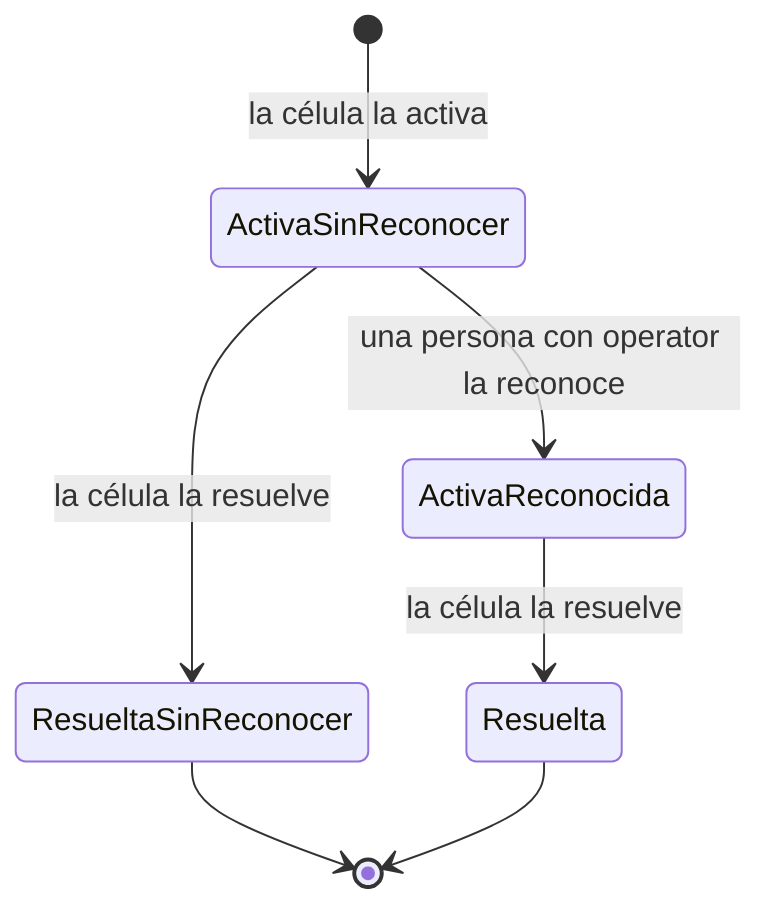

# ADR-0022: Reconocimiento de alarmas

- **Estado:** Aceptado
- **Fecha:** 2026-10-08
- **Responsable:** Andreu Mariner, Tech Lead
- **Tarea:** LF-122

## Contexto

El visor muestra las alarmas activas de cada célula, pero nadie puede decir «la he visto y me ocupo». En una planta con varias células y varios turnos eso tiene dos costes:

- **Nadie sabe si alguien está actuando.** Dos personas acuden a la misma avería, o ninguna porque cada una cree que va la otra.
- **No queda constancia.** Tras una incidencia no se puede saber cuánto tardó alguien en atenderla ni quién fue.

El Hito 6 (LF-120) añade el **reconocimiento de alarmas**. La norma de referencia es ISA-18.2 (gestión de alarmas en la industria de procesos): una alarma **reconocida** sigue activa hasta que desaparece su causa. Reconocer es una acción de la persona sobre la interfaz, no sobre la máquina.

Lo que ya existe:

- **Una alarma la identifican** la planta, la célula, su `code` y su `raisedAt` ([ADR-0004](0004-mensajes-de-telemetria-y-topics-mqtt.md)). Es la misma identidad que usan los avisos al móvil ([ADR-0015](0015-avisos-de-alarmas-en-el-movil.md)). Si una alarma se resuelve y vuelve a saltar, es otra activación, con otro `raisedAt`.
- **La máquina es la fuente de verdad de su estado** ([ADR-0003](0003-estados-de-la-paletizadora.md)). Las alarmas se activan y se resuelven en la célula; salir de un fallo exige un rearme en la célula.
- **Roles `viewer` y `admin`** en Keycloak ([ADR-0009](0009-autenticacion-y-autorizacion.md)). `admin` se reservó para administrar la plataforma.
- **La API solo lee del broker.** Su usuario MQTT no puede publicar en los topics de las células (`infra/mosquitto/acl`).

Hay que decidir:

1. Qué significa reconocer y qué no.
2. Quién puede hacerlo.
3. Dónde se guarda y cómo llega a los demás visores y al registro de eventos.
4. Qué pasa cuando la alarma se resuelve, vuelve a saltar o la célula se desconecta.
5. Qué se registra para la auditoría y qué amenazas hay que cubrir.

## Opciones consideradas

**Quién puede reconocer:**

1. **Cualquier usuario con `viewer`.**
2. **Solo `admin`.**
3. **Un rol nuevo, `operator`,** entre los dos.

**Qué hace el reconocimiento:**

- **A.** Solo se registra en LogicFlows: la célula no se entera.
- **B.** Además, se envía a la célula por MQTT, para que la máquina lo refleje.

**Ciclo de vida:**

- **I.** Simplificado: solo se reconocen alarmas activas. Una alarma que se resuelve sin reconocer queda marcada en el registro.
- **II.** ISA-18.2 completo, con alarmas «enclavadas»: una alarma resuelta sin reconocer sigue en pantalla hasta que alguien la reconoce.

## Decisión

### 1. Reconocer es «la he visto y me ocupo», nada más (opción A)

- **No resuelve la alarma ni rearma la célula.** La alarma sigue activa, y en pantalla, hasta que la máquina la resuelve.
- **No llega a la célula.** LogicFlows sigue sin escribir en la planta: la API no publica en MQTT y su usuario del broker sigue siendo de solo lectura.
- **No se puede deshacer ni editar.** Es un registro de un hecho.

### 2. Un rol nuevo, `operator` (opción 3)

- **`operator`** puede reconocer alarmas. Incluye todo lo de `viewer`.
- **`admin`** incluye `operator`, y además administra la plataforma (por ejemplo, el calendario de turnos, [ADR-0021](0021-calendario-de-turnos.md)).
- **`viewer`** sigue siendo de solo lectura. El usuario de la prueba de producción (LF-57) sigue siendo solo `viewer`, y la prueba comprueba que no tiene `operator` ni `admin`.

| Acción | `viewer` | `operator` | `admin` |
|---|---|---|---|
| Ver estado, producción, alarmas e histórico | Sí | Sí | Sí |
| Reconocer alarmas | No | **Sí** | Sí |
| Cambiar el calendario de turnos | No | No | Sí |

**Keycloak.** El rol se añade a `realm-logicflows.json` y a `realm-produccion.mjs` como rol compuesto: `operator` incluye `viewer`, y `admin` pasa a incluir `operator`. El usuario local `operario` pasa a tener `operator`. El realm de producción ya existe y `--import-realm` no lo modifica, así que, una sola vez, el titular crea el rol en la consola, lo añade a `admin` y lo asigna a quien corresponda. Los pasos irán en `infra/keycloak/README.md` (LF-126).

### 3. Ciclo de vida simplificado (opción I)

- **Solo se reconoce una alarma activa.** Reconocer una que ya no está activa responde 409.
- **Resuelta sin reconocer** no es un estado en pantalla: la alarma desaparece del visor, como hoy. En el registro de eventos queda que nadie la reconoció, que es lo que interesa analizar.
- **Si vuelve a saltar,** es una activación nueva (otro `raisedAt`) y hay que reconocerla otra vez.
- **Si la célula se desconecta,** sus alarmas siguen como estaban en el último dato conocido, que el visor ya marca como tal. Se pueden reconocer: la persona puede ir a la célula aunque no haya conexión.

### 4. Dónde se guarda y cómo llega

- **Tabla `alarm_acknowledgements`** en PostgreSQL, con migración aditiva ([ADR-0007](0007-acceso-a-datos-y-migraciones.md)):

  | Columna | Contenido |
  |---|---|
  | `site_id`, `cell_id`, `code`, `raised_at` | La activación reconocida. **Clave primaria:** solo se reconoce una vez |
  | `acknowledged_at` | Hora del servidor, nunca del navegador |
  | `acknowledged_by` | `sub` del token: identifica a la persona aunque cambie de nombre |
  | `acknowledged_by_name` | `preferred_username` del token en ese momento, para mostrarlo |

  Se conserva lo mismo que los cambios de estado: 365 días ([ADR-0016](0016-almacenamiento-del-historico.md)).
- **API:** `POST /api/v1/sites/{siteId}/cells/{cellId}/alarms/{code}/acknowledgements`, con el `raisedAt` de la activación en el cuerpo. Rol `operator`.
  - **201** si la reconoce.
  - **200** con el reconocimiento existente si ya estaba reconocida, por quien fuera. Así es idempotente: si dos personas pulsan a la vez, o el visor reintenta tras un corte, nadie ve un error.
  - **409** si esa activación no está activa en el último estado conocido de la célula.
  - **403** sin el rol, comprobado en la API. Ocultar el botón en el visor es comodidad, no seguridad.
- **Tiempo real:** la instantánea de cada célula del canal en tiempo real ([ADR-0006](0006-canal-de-tiempo-real.md)) añade los reconocimientos de sus alarmas activas. Al reconocer, la API emite la célula actualizada a todos los visores. Es un campo nuevo en el contrato del canal: el visor antiguo lo ignora.
- **Registro de eventos e histórico:** el reconocimiento aparece como un evento más de la célula (quién y cuándo) en el registro de LF-84 y en el CSV. Cada alarma del registro indica si se reconoció y cuánto se tardó.
- **Avisos al móvil:** no cambian. Se avisa una vez por activación (ADR-0015). Al tocar el aviso, la app abre el detalle de la célula, desde donde se reconoce.

### 5. Auditoría

Cada reconocimiento se escribe también en el log estructurado de la API con `audit: true`, el evento `alarm.acknowledged`, la alarma, el `sub` y la IP de origen. Los cambios del calendario (ADR-0021) usan el mismo formato con sus propios eventos. Se buscan con los registros de Railway, o en la observabilidad de [ADR-0013](0013-observabilidad.md) cuando esté activa, sin acceder a la base de datos.

### 6. Modelo de amenazas

| Amenaza | Ejemplo | Mitigación |
|---|---|---|
| **Suplantación** | Reconocer en nombre de otro | La identidad sale solo del token validado (`sub`, `preferred_username`), nunca del cuerpo de la petición |
| **Elevación de privilegios** | Un `viewer` llama a la API directamente | El rol se comprueba en la API (403). Prueba de integración por rol |
| **Manipulación de la planta** | Usar el reconocimiento para actuar sobre la máquina | No hay camino: la API no publica en MQTT y su usuario del broker es de solo lectura |
| **Repudio** | «Yo no la reconocí» | Registro inmutable en la tabla y en el log de auditoría, con hora del servidor |
| **Falsificación de peticiones (CSRF)** | Una web ajena hace que el navegador reconozca | La API usa `Authorization: Bearer`, no cookies: el navegador no adjunta credenciales solo |
| **Abuso o automatización** | Reconocer todo con un script para silenciar alarmas | Límite de peticiones de la API (LF-52). Reconocer no oculta la alarma: sigue activa en pantalla |
| **Exposición de datos** | Saber quién reconoció qué | Visible para cualquiera con `viewer` de la misma instalación, como en una planta. Solo el nombre de usuario, sin correo ni otros datos |
| **Carrera con la resolución** | La alarma se resuelve mientras se reconoce | Se acepta el reconocimiento si la alarma estaba activa al comprobarlo. Queda registrado, y no causa daño: describe un hecho real |

## Justificación

**Un rol nuevo frente a usar `viewer` o `admin`.** Con `viewer`, cualquier cuenta de consulta (una pantalla de pasillo, un directivo, el usuario técnico de la prueba de producción) podría silenciar la atención sobre una alarma. Con `admin`, el operario de turno tendría también permiso para cambiar el calendario o, más adelante, la configuración de la planta: más privilegio del que necesita. Un rol intermedio es lo que hacen los sistemas SCADA (operador, supervisor, ingeniero) y cuesta poco: una entrada en el realm y una línea en la comprobación de roles. ADR-0009 ya preveía revisar los roles «cuando aparezcan acciones sobre la planta».

**Solo en LogicFlows (A) frente a enviarlo a la célula (B).** Enviarlo a la célula obligaría a dar permiso de escritura a la API en el broker, a ampliar el contrato con mensajes de la nube a la planta y a confiar en que cada PLC lo interprete bien. Abre una vía de la nube a la máquina que hoy no existe, y que en seguridad industrial (IEC 62443) se justifica con mucho cuidado. Para coordinar a las personas, que es el problema, no hace falta: el HMI de la célula tiene su propio reconocimiento local.

**Ciclo simplificado (I) frente a ISA-18.2 con enclavamiento (II).** El enclavamiento sirve para que una alarma breve no pase inadvertida en una sala de control vigilada de forma continua. En LogicFlows, que se consulta desde el móvil y la web, dejaría alarmas resueltas en pantalla hasta que alguien las limpie, y mezclaría lo que pasa ahora con lo que ya pasó. El registro de eventos cubre el análisis («resuelta sin reconocer») sin ensuciar la vista en directo. Se puede añadir más adelante sin cambiar la tabla.

**Idempotente (200) frente a rechazar el segundo reconocimiento (409).** Dos personas que pulsan a la vez quieren lo mismo. Devolver el reconocimiento existente les dice quién llegó antes, sin un error que no sabrían resolver.

**Sin comentario libre.** Un campo de texto invita a escribir datos personales o de terceros y abre una superficie más de inyección. Para coordinar basta con quién y cuándo. Si se pide, se añadirá con longitud limitada y sin HTML.

## Alternativas descartadas

- **Reconocer con `viewer` (opción 1).** Solo tendría sentido en una instalación donde todos los usuarios sean operarios.
- **Reconocer solo con `admin` (opción 2).** Obliga a dar privilegios de administración a quien solo atiende alarmas.
- **Enviar el reconocimiento a la célula (B).** Se reconsiderará con la conexión a planta real, si un cliente quiere que el HMI y LogicFlows compartan el estado de reconocimiento. Exigiría su propio ADR de comandos hacia la planta.
- **ISA-18.2 completo (II).** Junto con la supresión temporal de alarmas (*shelving*), queda para cuando LogicFlows se use como consola de operación y no solo de supervisión.
- **Guardar el reconocimiento en el estado en memoria.** Se perdería al reiniciar la API, y no serviría para la auditoría.

## Consecuencias

**Positivas:**

- Quien mira el visor sabe si alguien atiende cada alarma, y quién.
- Queda constancia de cuánto se tarda en atender cada alarma: un indicador nuevo para el histórico.
- LogicFlows sigue sin poder actuar sobre la planta.
- Los permisos quedan separados por responsabilidad: consultar, operar y administrar.

**Costes y riesgos:**

- **Un rol más que mantener** en Keycloak, con un paso manual en el realm de producción.
- **Una tabla y un endpoint nuevos,** y un campo más en el canal de tiempo real y en el registro de eventos (LF-126, LF-128).
- **El estado de reconocimiento no se comparte con el HMI de la célula.** Una alarma reconocida en la máquina aparece sin reconocer en LogicFlows, y al revés.
- **Con varias réplicas de la API,** la comprobación de «activa» usa el último estado de cada réplica, que puede ir unos milisegundos por detrás. La clave primaria evita duplicados.

## Criterios de revisión

- LogicFlows pasa a usarse como consola de operación en una sala de control: alarmas enclavadas y supresión temporal.
- Un cliente quiere compartir el reconocimiento con el HMI de la célula.
- Hacen falta permisos por planta o por célula, por ejemplo un operario que solo atiende sus células.
- Se pide un comentario o una causa al reconocer.

## Referencias

- ANSI/ISA-18.2: Management of Alarm Systems for the Process Industries
- IEC 62443: seguridad de los sistemas de automatización y control industrial
- [ADR-0003: Estados de la paletizadora](0003-estados-de-la-paletizadora.md)
- [ADR-0009: Autenticación y autorización](0009-autenticacion-y-autorizacion.md)
- [ADR-0015: Avisos de alarmas en el móvil](0015-avisos-de-alarmas-en-el-movil.md)
