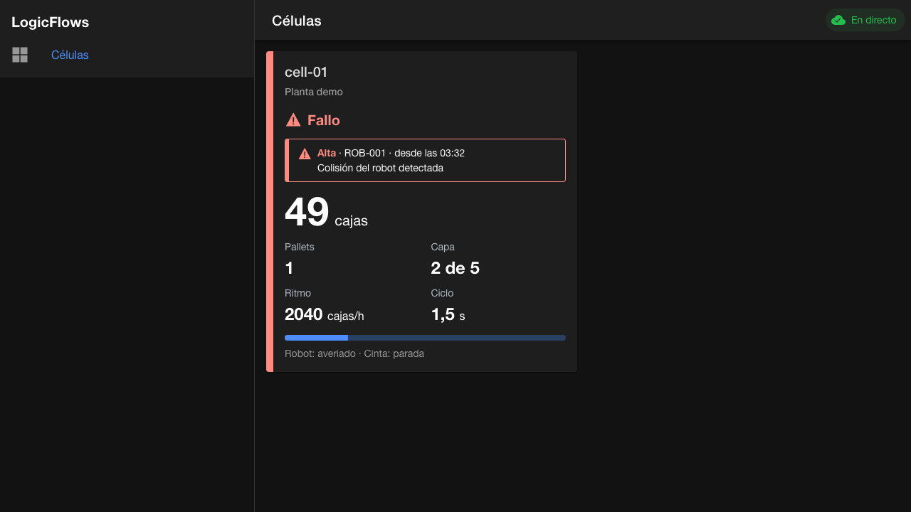

# Demo del Hito 1

Guion para enseñar LogicFlows `v0.1.0` en unos 15 minutos: desde el arranque hasta una célula que falla, se recupera y sigue produciendo. Sirve para una demo en directo y como comprobación manual de que el sistema completo funciona. El sistema desplegado se enseña con la [demo del Hito 2](demo-hito-2.md).

## Preparación

Con el [arranque rápido](../README.md#arranque-rápido) hecho, se cambia el simulador al escenario `demo`, con los tiempos acortados para que todo ocurra en pocos minutos. En `.env`:

```sh
SIMULATOR_SCENARIO=demo
SIMULATOR_BOX_INTERVAL_MS=1500
SIMULATOR_FAULT_RECOVERY_MS=6000
SIMULATOR_EMERGENCY_STOP_RECOVERY_MS=8000
SIMULATOR_RESTART_DELAY_MS=2000
```

Y se vuelve a levantar el sistema:

```sh
docker compose --profile apps up -d --build --wait
```

Abrir el visor en `http://localhost:8100` en un navegador de escritorio y, si es posible, en un móvil de la misma red, o con la vista de dispositivo del navegador.

## Recorrido



| Paso | Qué hacer | Qué se ve | Qué demuestra |
|---|---|---|---|
| 1 | Abrir el visor e iniciar sesión con `operario` / `operario-local` | El inicio de sesión de LogicFlows y, después, la célula `cell-01` «Produciendo» con el indicador «En directo» | Inicio de sesión con OpenID Connect; simulador, broker, API y visor conectados |
| 2 | Observar el contador | Las cajas, la capa y el avance del palé aumentan sin recargar; al completar 40 cajas cuenta un palé y empieza otro | Tiempo real por WebSocket, ciclo de paletizado realista |
| 3 | Esperar una incidencia | «En espera» en ámbar, con la causa: sin cajas o salida ocupada | Estado `WAITING` de ADR-0003: la máquina está bien, el problema es externo |
| 4 | Esperar un fallo | «Fallo» en rojo, con la alarma, su severidad y desde cuándo; la producción se detiene | Alarmas con texto, icono y color (ISA-101); nunca solo color |
| 5 | Esperar la recuperación | La alarma desaparece, la célula pasa por «Detenida» y «Arrancando» y vuelve a producir | El rearme nunca arranca la máquina por sí solo (ADR-0003) |
| 6 | Esperar una parada de emergencia | Aviso global en la parte superior y alarma crítica | La situación más grave se ve desde cualquier vista |
| 7 | `docker compose stop simulator` | «Célula desconectada: último dato conocido», con los indicadores atenuados | El simulador anuncia su desconexión al detenerse; si se cortara sin avisar, lo haría el broker con su última voluntad |
| 8 | `docker compose start simulator` | La célula arranca y vuelve a producir, sin recargar el visor; el contador empieza desde cero | Nueva sesión del simulador: los contadores son acumulados por sesión (ADR-0004) |
| 9 | `docker compose restart api` | El indicador pasa a «Sin conexión» o «Conectando…» y vuelve a «En directo»; los contadores se mantienen | Reconexión automática y recuperación del estado desde PostgreSQL |
| 10 | Recargar la página | Los datos aparecen al instante | Carga inicial por REST combinada con el tiempo real |
| 11 | Abrir `http://localhost:3000/docs`; pulsar «Authorize» con un token si se quiere probar desde ahí | Documentación OpenAPI; probar «Producción de una célula en un periodo» | API REST documentada; la producción del periodo suma todas las sesiones, también las anteriores al paso 8 |
| 12 | Cambiar el tema del sistema o abrir en móvil | Tema claro u oscuro y diseño de una columna | Diseño adaptable y accesible (WCAG 2.2 AA) |

Los pasos 7 a 10 se comprobaron con el sistema en contenedores: la desconexión aparece en menos de un segundo, el reinicio de la API conserva los contadores y, tras recargar, los datos aparecen en menos de 100 ms.

Las incidencias del escenario `demo` son aleatorias: si alguna tarda, se puede seguir con los pasos siguientes y volver a ella. Con `SIMULATOR_SEED` fijo, la secuencia se repite exactamente en cada ensayo.

## Después de la demo

```sh
docker compose --profile apps down --volumes
```

Y se restauran en `.env` los valores de `.env.example`.
