# LogicFlows · Dosier de diseño

El visor de LogicFlows en una página: qué se ve, por qué se ve así y cómo se mantiene. Resultado del **Hito 5 · Rediseño visual** (`v0.5.0`).

> **Una idea guía todo el diseño:** en planta, la pantalla se mira de lejos y con prisa. La interfaz es neutra y el color intenso solo aparece cuando algo requiere atención, como pide la norma ISA-101 de interfaces de operación.

Todas las imágenes salen del visor real, no de maquetas. Las pantallas y la lámina del sistema de diseño son las capturas de referencia que la CI compara en cada cambio ([LF-110](https://logicflows.atlassian.net/browse/LF-110), [LF-104](https://logicflows.atlassian.net/browse/LF-104)). Así, el dosier no se queda atrás respecto al producto.

## Antes y después

La exploración partió de propuestas generadas con Google Stitch. El visor final conserva su tono y descarta lo que no era cierto: certificaciones inventadas, funciones que no existen y textos en inglés ([exploración](exploracion-stitch.md)).

| Exploración (Stitch) | Visor `v0.5.0` |
|---|---|
| 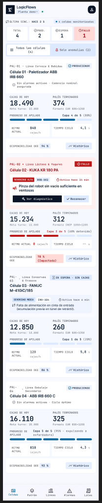 | 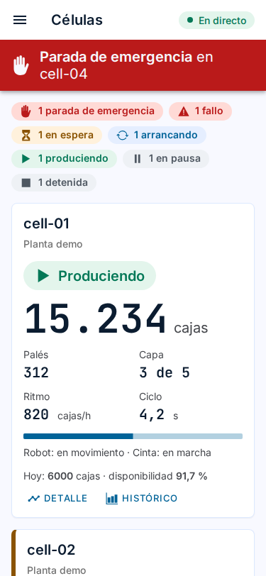 |
| 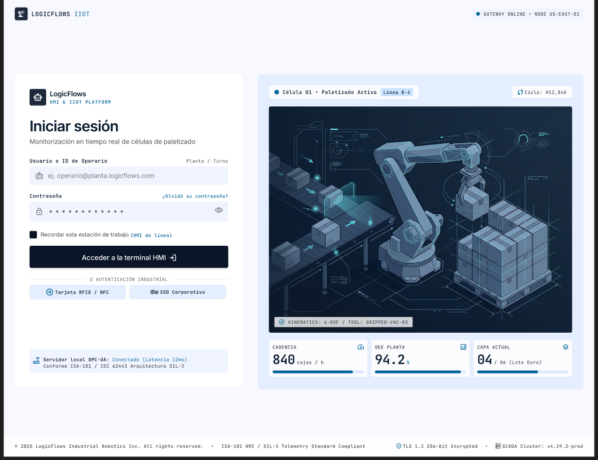 | 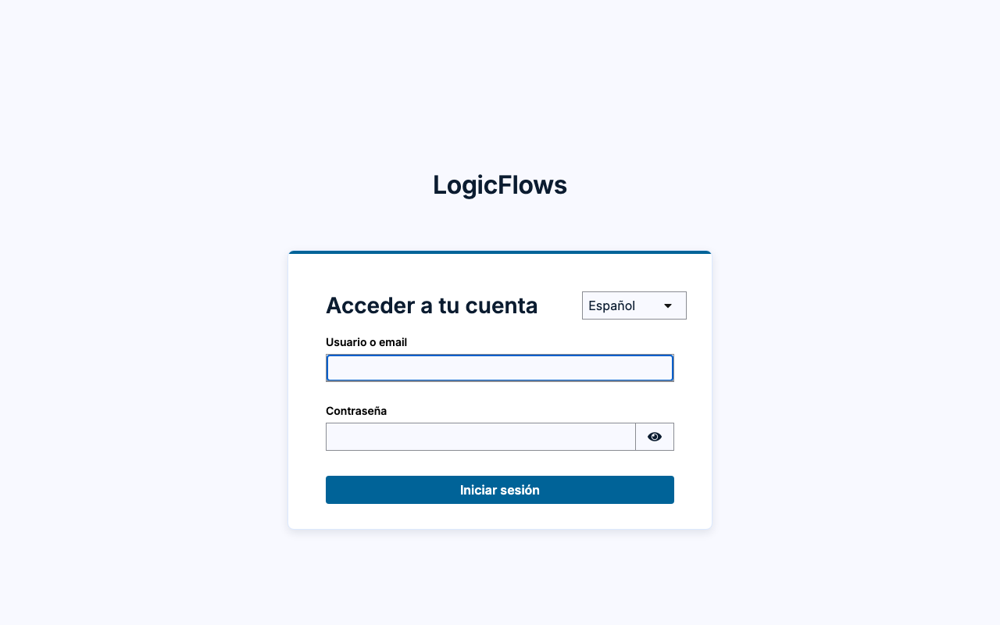 |

## Las pantallas

### Panel: toda la planta de un vistazo

El resumen de estados va encima de las tarjetas, ordenado de lo más grave a lo normal. Una tarjeta solo lleva borde de color cuando la célula requiere atención.

| Claro | Oscuro |
|---|---|
| 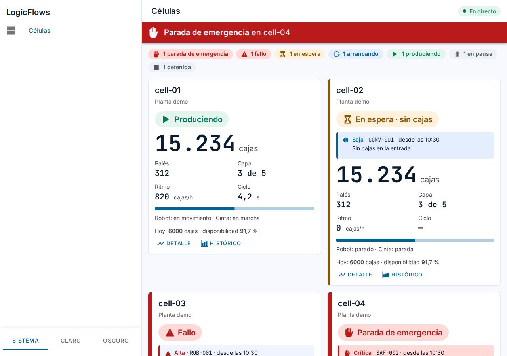 | 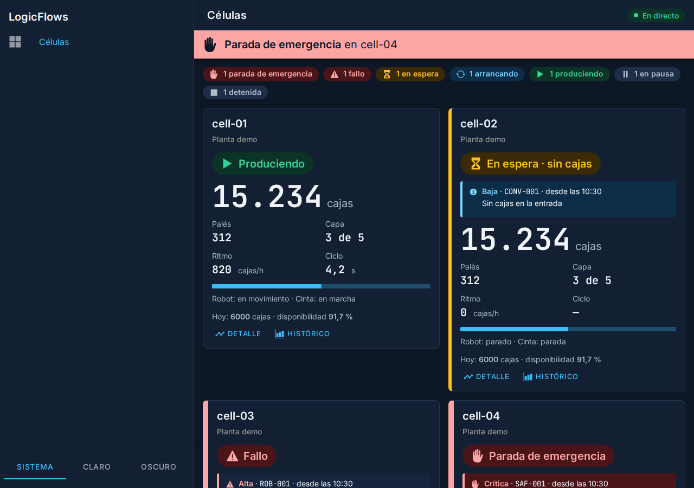 |

### Detalle de una célula: el esquema de la cinta, el robot y el palé

Es el único elemento expresivo del visor. Las piezas en marcha van en verde discreto y solo la avería va en rojo. El palé se dibuja capa a capa, y todo lo que dice el dibujo también se dice en texto.

| Claro | Oscuro | Móvil |
|---|---|---|
| 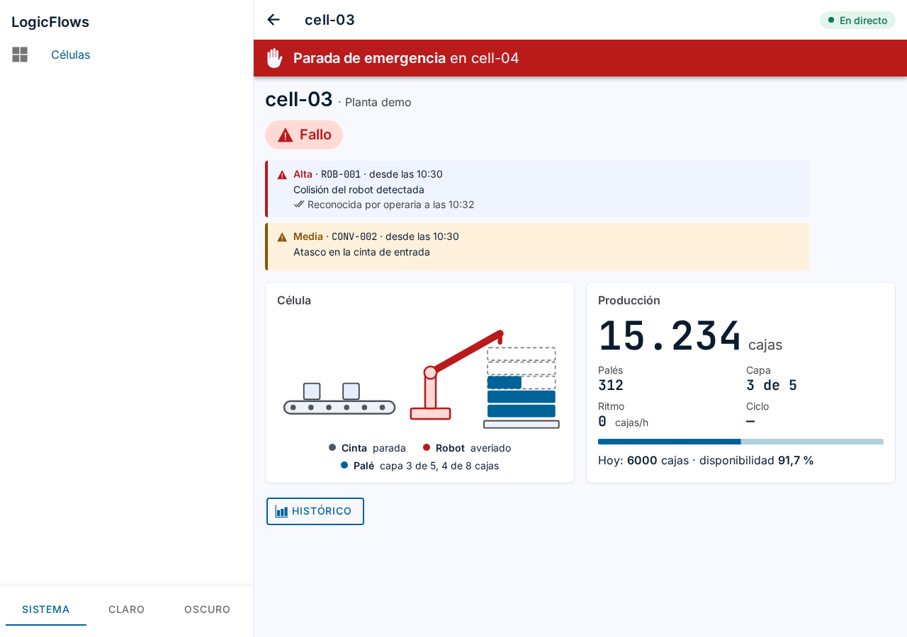 | 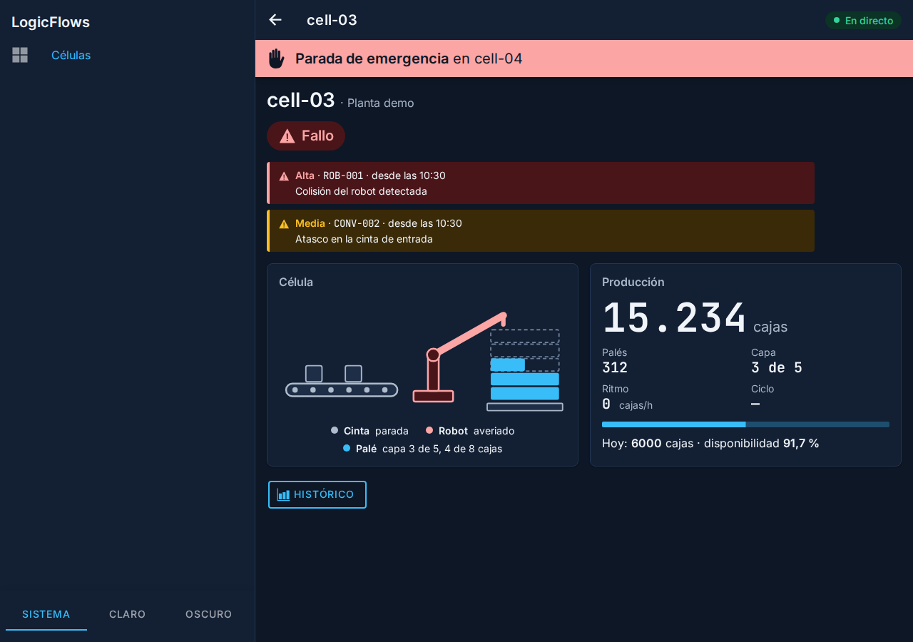 | 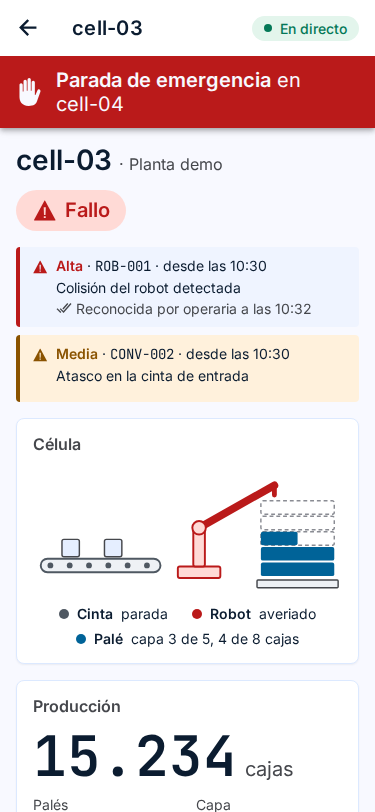 |

### Histórico: qué produjo la célula y por qué se paró

Indicadores, gráfico con su tabla equivalente, paradas por causa y registro de estados y alarmas, cada bloque en su panel.

| Claro | Oscuro |
|---|---|
| 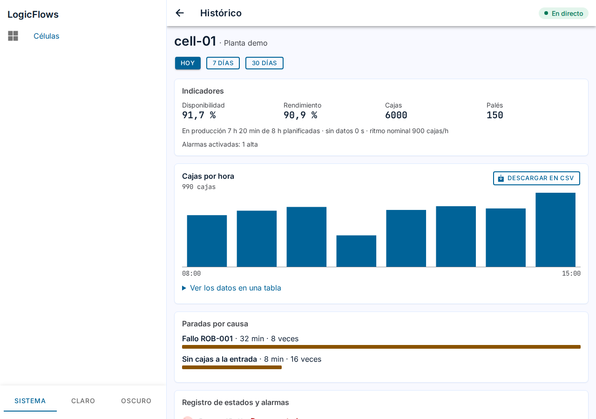 | 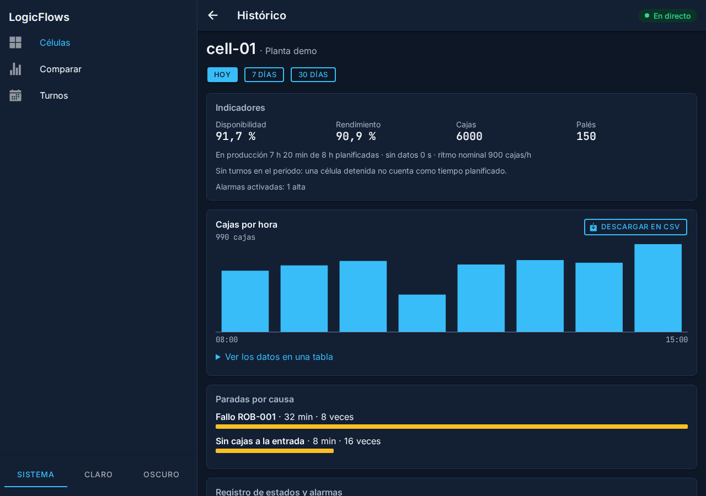 |

## El sistema de diseño

Un único juego de tokens (`@logicflows/design-tokens`, [ADR-0020](../adr/0020-tokens-de-diseno.md)) da estilo al visor web, a la app Android y al inicio de sesión. La lámina se dibuja con esos tokens, así que muestra los valores reales.

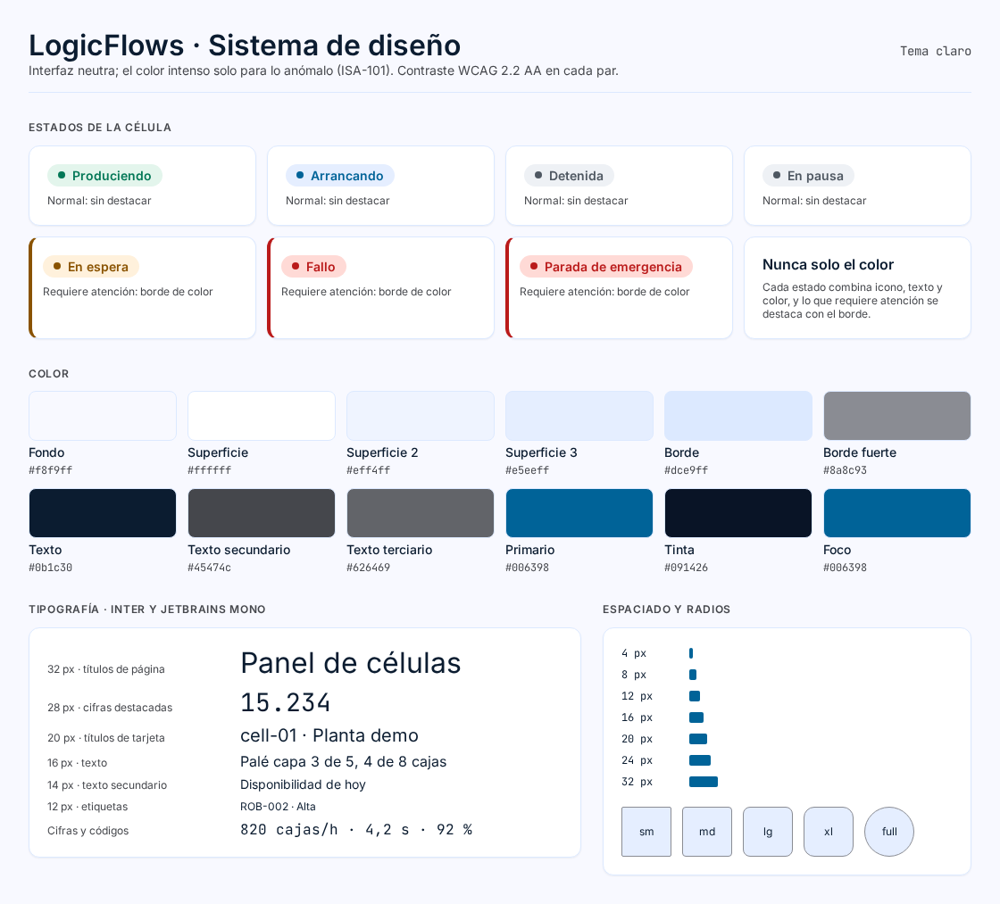

Tema oscuro

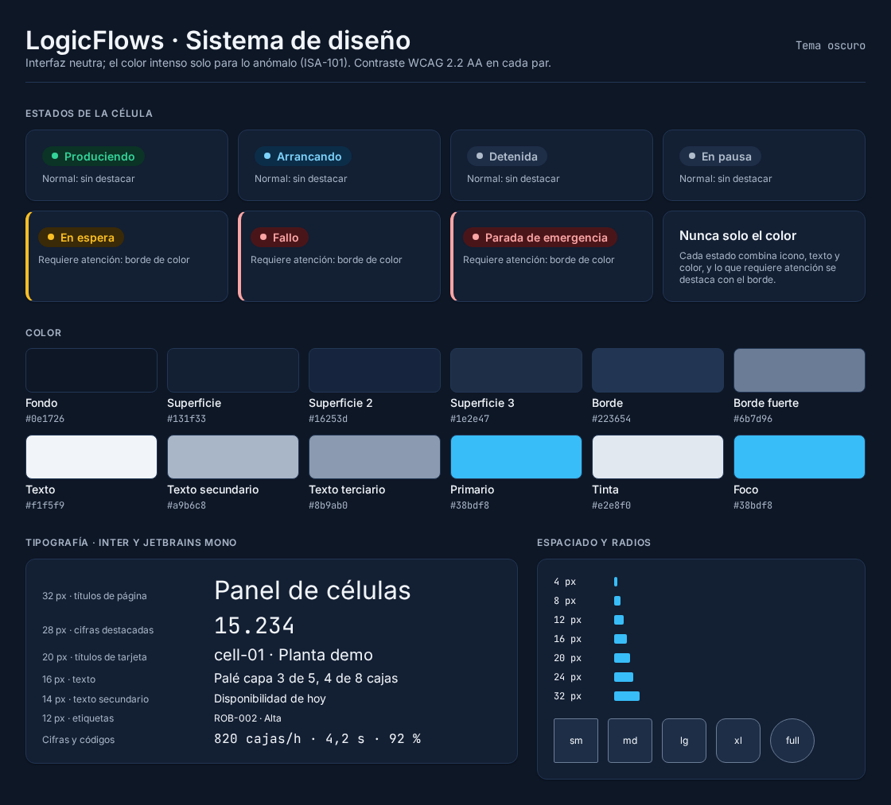

- **Color:** superficies neutras y un primario azul para la información y las acciones. Verde discreto para «Produciendo», ámbar para las esperas y rojo solo para fallos y paradas de emergencia.
- **Tipografía:** Inter para el texto y JetBrains Mono para cifras y códigos, que no bailan al actualizarse. El texto nunca baja de 12 px.
- **Nunca solo color:** cada estado combina icono, texto y color.
- **Claro y oscuro:** el visor sigue al sistema o al tema elegido por el usuario.

## Cómo se garantiza

| Qué | Cómo | Dónde |
|---|---|---|
| Contraste WCAG 2.2 AA | Una prueba calcula el contraste de cada par de texto y fondo, en los dos temas | `packages/design-tokens` |
| Accesibilidad de las pantallas | axe-core sin infracciones en cada pull request | CI, trabajo «Accesibilidad» |
| Sin cambios visuales por accidente | Capturas de referencia de las pantallas y de esta lámina | CI, `apps/dashboard/e2e/capturas/` |
| Marca coherente | Iconos y pantalla de arranque generados desde un único pictograma | `pnpm --filter @logicflows/dashboard marca` |

El proceso completo, de la exploración al código, está en [proceso.md](proceso.md). El detalle de cada pantalla, en [pantallas.md](pantallas.md).
