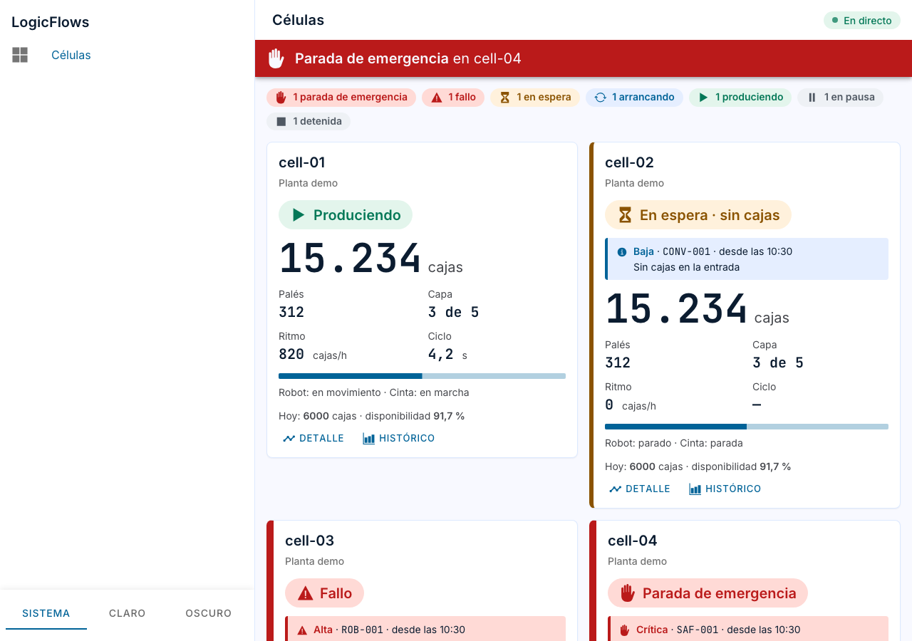
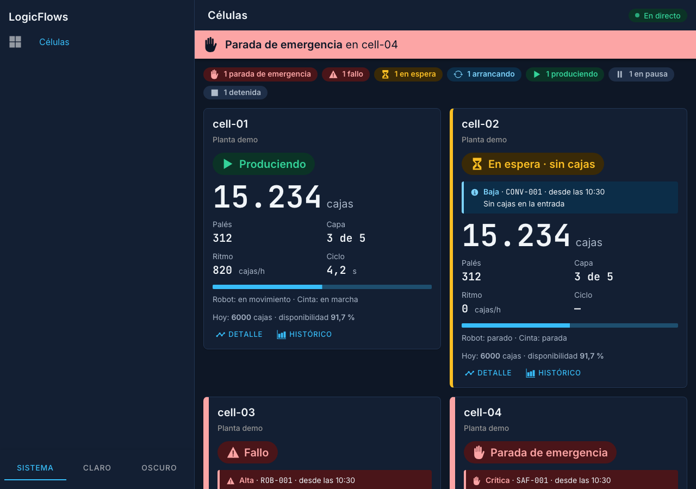
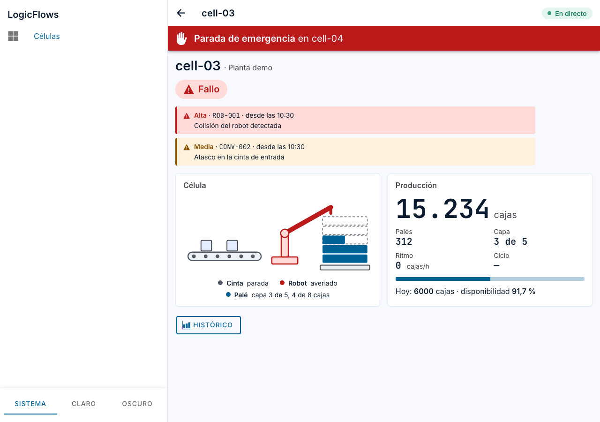
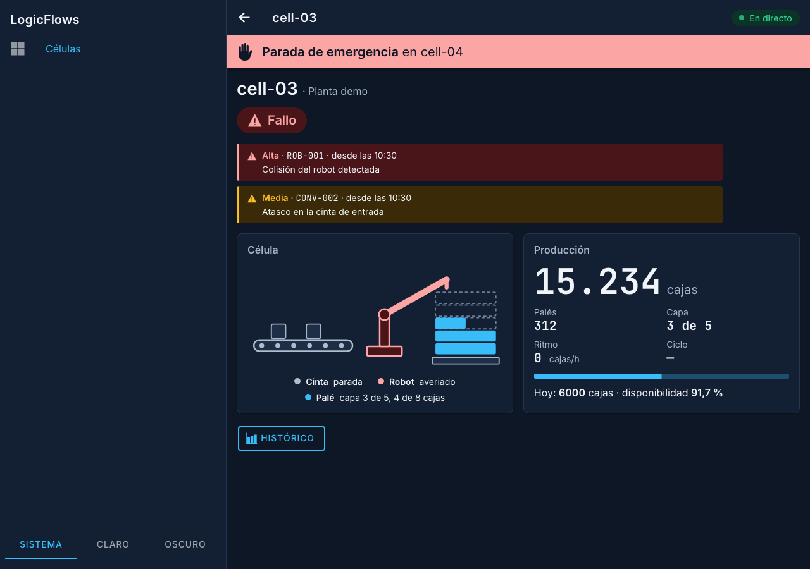
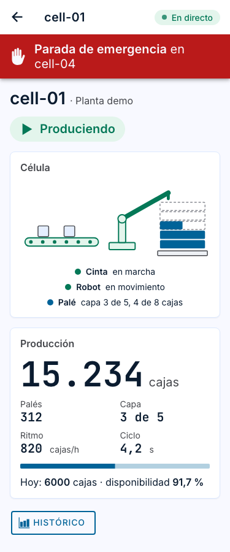
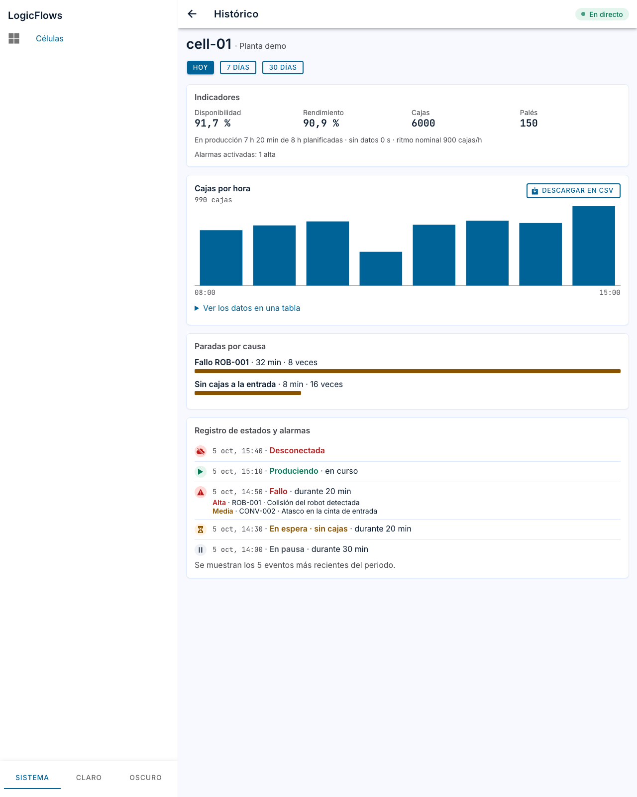
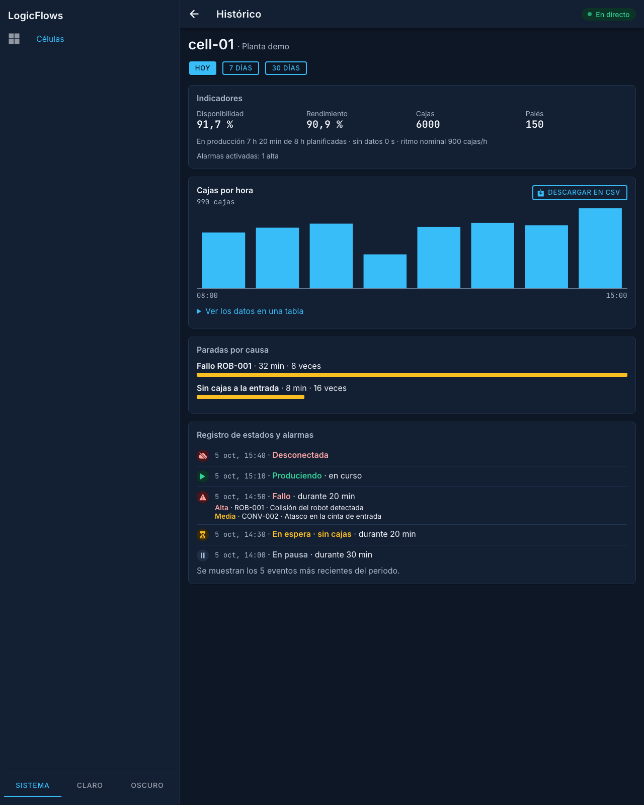

# Pantallas del visor (Hito 5)

Resultado de [LF-106](https://logicflows.atlassian.net/browse/LF-106) y [LF-107](https://logicflows.atlassian.net/browse/LF-107): el panel, el nuevo detalle de una célula y el histórico con los tokens de diseño ([ADR-0020](../adr/0020-tokens-de-diseno.md)) y los componentes base (LF-103), según la dirección elegida en la [exploración con Stitch](exploracion-stitch.md).

| Panel · claro | Panel · oscuro |
|---|---|
|  |  |

| Detalle · claro | Detalle · oscuro | Detalle · móvil |
|---|---|---|
|  |  |  |

Las capturas salen de la build de producción con la API simulada de las pruebas en navegador (`e2e/fixtures.ts`).

## Panel

- **Resumen de estados** encima de las tarjetas: cuántas células hay en cada estado, de lo más grave a lo normal, con las mismas etiquetas que las tarjetas. Solo aparecen los estados que tiene alguna célula.
- **Tarjeta:** superficie con borde fino y sombra discreta. El borde izquierdo de color solo aparece en los estados que requieren atención, más grueso en fallo y parada de emergencia (ISA-101).
- **Enlaces** a «Detalle» y a «Histórico» de cada célula.

## Detalle (`/cells/:siteId/:cellId`)

- Estado, alarmas activas, **esquema de la célula** e indicadores de producción, en tiempo real. También lo que lleva hoy la célula.
- **Esquema cinta → robot → palé:** el único elemento expresivo del visor, como se decidió en la exploración.
  - Las piezas en marcha van en verde discreto y las paradas en neutro. Solo una avería va en rojo.
  - El palé se dibuja capa a capa: las terminadas llenas, la que está en curso con su avance y las que faltan discontinuas.
- **El dibujo es decorativo** (`aria-hidden`). Lo mismo se dice en texto debajo («Robot averiado», «Palé capa 3 de 5, 4 de 8 cajas»), así que no depende del color ni de ver el dibujo.
- El aviso de parada de emergencia sigue siendo global: se ve aunque la célula detenida sea otra.

## Diferencias con la exploración, decididas en código

- **El esquema solo usa datos del contrato** (ADR-0004): estado del robot y de la cinta, y capa y cajas del palé en curso. No muestra modelo de robot, formato del palé ni metas de turno, que la exploración inventaba.
- **Etiquetas de 14 px como mínimo**, y la monoespaciada solo en cifras y códigos de alarma. La exploración usaba etiquetas de 10 px.
- **Sin navegación inferior ni acciones sobre las alarmas.** Reconocer alarmas es parte de la operación de planta.

## Histórico

| Histórico · claro | Histórico · oscuro |
|---|---|
|  |  |

- **Cada bloque en su panel**, como el detalle: indicadores, gráfico, paradas por causa y registro.
- **Indicadores** con `app-indicator`: cifras en monoespaciada, como en el resto del visor.
- **Gráfico** en el color primario, con el eje y la tabla equivalente en monoespaciada. Conserva su resumen para lectores de pantalla y la tabla.
- **Registro:** el icono de cada entrada va sobre el fondo suave de su tono, como las etiquetas de estado, y la hora en monoespaciada. Las alarmas de cada entrada siguen en una línea («Alta · ROB-001 · mensaje»): es un registro compacto, no el aviso destacado de la tarjeta.
