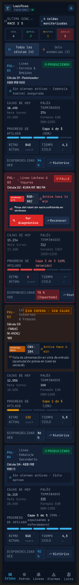
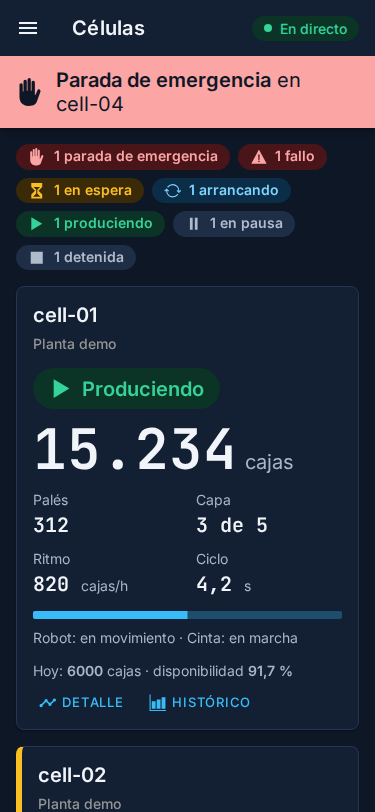
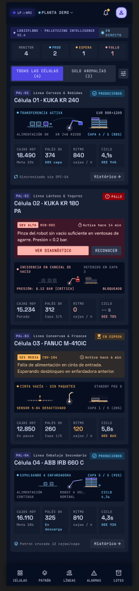

# Proceso de diseño: de la exploración al código

Cómo se rediseñó el visor en el Hito 5, para repetirlo en las pantallas siguientes (por ejemplo, la operación de planta) y para enseñarlo en el dosier. El resultado está en [Pantallas del visor](pantallas.md) y las reglas, en [Diseño del visor](../diseno-del-visor.md).

## Resumen

| Paso | Herramienta | Quién decide | Qué queda versionado | Tarea |
|---|---|---|---|---|
| 1. Explorar | Google Stitch | Tech Lead: elige la dirección | Prompts, capturas y revisión en [exploracion-stitch.md](exploracion-stitch.md); pantallas en Figma, página *01 · Exploración* | LF-100 |
| 2. Filtrar | Revisión del Tech Lead | Tech Lead | La lista de lo que se descarta, en el mismo documento | LF-100 |
| 3. Decidir los tokens | ADR | Tech Lead, con alternativas | [ADR-0020](../adr/0020-tokens-de-diseno.md) | LF-102 |
| 4. Tokens en código | `@logicflows/design-tokens` | Frontend; contraste comprobado en la CI | `tokens.css`, fuentes y prueba de contraste | LF-101 |
| 5. Tema y componentes | Angular e Ionic | Frontend, revisado en la pull request | Tema claro y oscuro y componentes base en `src/app/ui/` | LF-105, LF-103 |
| 6. Pantallas | Angular | Frontend; revisión visual en la pull request | Pantallas y capturas en [pantallas.md](pantallas.md) | LF-106, LF-107, LF-108 |
| 7. Comprobar | axe-core, Playwright | La CI | Capturas de referencia en `apps/dashboard/e2e/capturas/` | LF-110 |
| 8. Llevar a Figma | Figma | Tech Lead | Pantallas implementadas en Figma, página *04 · Pantallas* | LF-104 |

## Los pasos

### 1. Explorar con una herramienta generativa

Stitch genera en minutos varias direcciones a partir de un prompt con el contexto del producto (qué es una célula de paletizado, quién mira el visor y desde dónde) y la regla de ISA-101. Sirve para **ver opciones antes de gastar tiempo de diseño**, no para obtener el diseño final. Se pidió una dirección sobria en claro y oscuro, una expresiva, la adaptación a móvil y otras pantallas.

### 2. Filtrar lo que la herramienta inventa

Una herramienta generativa rellena huecos con lo verosímil. En la exploración aparecieron certificaciones falsas, funciones que no existen, datos que no están en el contrato, textos en inglés y etiquetas de 10 px. **Antes de pasar a código se descarta todo eso** y queda escrito por qué ([revisión](exploracion-stitch.md#revisión-del-tech-lead)). De la exploración se quedan el tono, la paleta, la tipografía y una idea: el esquema de la célula.

### 3. Decidir cómo se guardan los valores

Antes de escribir CSS se decide **dónde vive cada decisión de diseño**. Figma no puede ser la fuente: en el plan gratuito no se lee de forma automática y no admite claro y oscuro en una colección de variables. Se eligió un paquete de tokens en código, compartido por el visor y el inicio de sesión (ADR-0020).

### 4. Tokens en código, con su prueba

`tokens.css` define variables con nombre semántico (`--lf-color-danger-fg`, no `--lf-red-700`) en claro y oscuro. Una prueba calcula el contraste de cada par de texto y fondo: **un color que baje de 4,5:1 no llega a ninguna pantalla**.

### 5. Tema y componentes antes que pantallas

Primero el mecanismo de tema: los tokens en Ionic y el selector claro, oscuro o del sistema. Después, piezas pequeñas que solo usan tokens: etiqueta de estado, alarma, indicador y cabecera. Así las pantallas se componen con piezas ya probadas y accesibles, y un cambio de tono se hace en un sitio.

### 6. Pantallas, revisadas en la pull request

Cada pantalla se rediseña en su pull request, con capturas en claro, oscuro y móvil. Las diferencias con la exploración que se deciden en código quedan anotadas en [pantallas.md](pantallas.md). La revisión visual se hace sobre el visor real con la API simulada, no sobre un dibujo.

### 7. Comprobar en cada cambio

- axe-core comprueba WCAG 2.2 AA en claro y en oscuro, en tres tamaños de pantalla.
- Las capturas de referencia detectan cualquier cambio visual no buscado. Si el cambio es el buscado, se actualizan en la misma pull request.

### 8. Llevar el resultado a Figma

Figma recibe **al final** las pantallas implementadas, junto a la exploración, para el dosier y para comparar el antes y el después. No hay sincronización automática: si un token cambia, se cambia en el código y después se actualizan las capturas.

## Antes y después

| | Exploración (Stitch) | Visor implementado |
|---|---|---|
| Panel, claro, móvil |  |  |
| Panel, oscuro, móvil |  |  |
| Esquema de la célula |  |  |
| Inicio de sesión |  |  |

Lo que cambió al pasar a producto: solo datos del contrato, textos en español con coma decimal, etiquetas legibles (14 px), la monoespaciada solo en cifras y códigos, y el esquema de la célula en el detalle en lugar de en cada tarjeta.

## Lo que se aprendió

- **La herramienta generativa acelera la exploración, no la decisión.** El trabajo de criterio, como filtrar lo inventado o elegir qué se queda, sigue siendo del equipo.
- **Decidir dónde viven los valores antes de diseñar** evita mantener dos fuentes que se separan.
- **Probar el contraste en los tokens** es más barato que encontrarlo pantalla a pantalla.
- **Componentes primero:** las pantallas salieron en una tarea cada una, sin repetir estilos.
- **Revisar el resultado real:** el presupuesto de tamaño, las fuentes sin conexión o la ruta de `node_modules` en el entorno local solo aparecieron al compilar y desplegar.

## Para la siguiente pantalla

1. Escribir el prompt con el contexto y las reglas de [Diseño del visor](../diseno-del-visor.md).
2. Explorar y filtrar; documentar la elección en `docs/diseno/`.
3. Si hace falta un color o un tamaño nuevo, añadirlo como token con su prueba de contraste.
4. Componer con los componentes de `src/app/ui/`; crear uno nuevo solo si se va a reutilizar.
5. Capturas en la pull request y, si la pantalla es clave, añadirla a las capturas de referencia.
6. Al cerrar el hito, llevar las pantallas a Figma.
